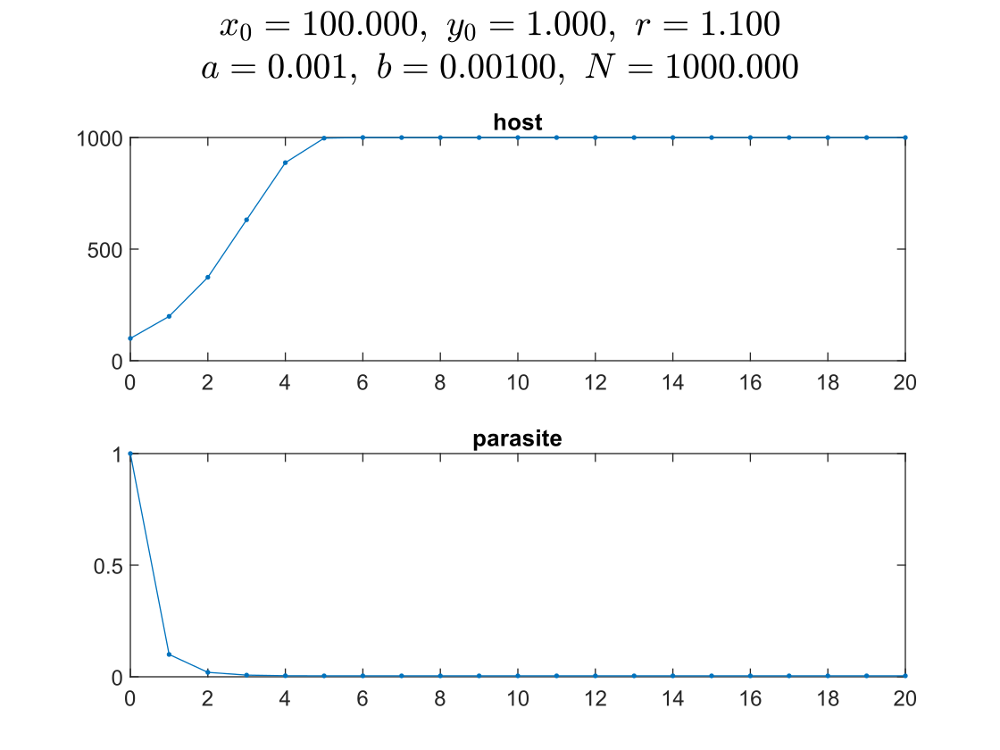
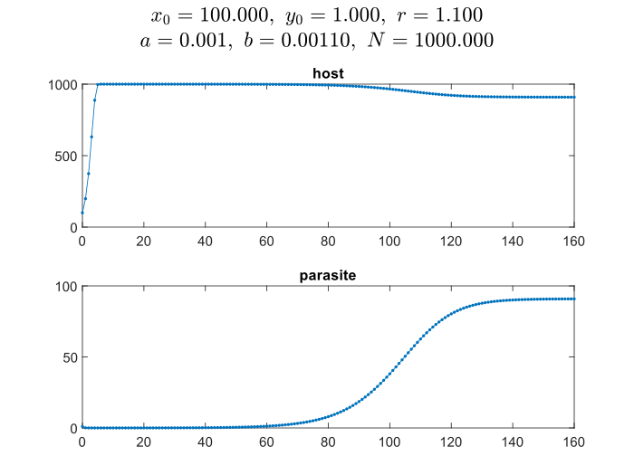
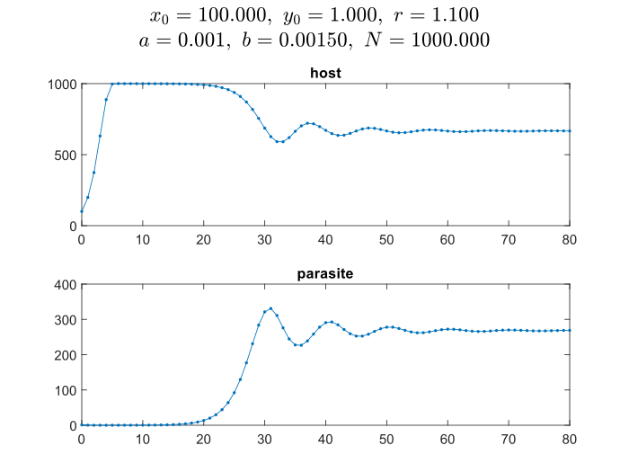
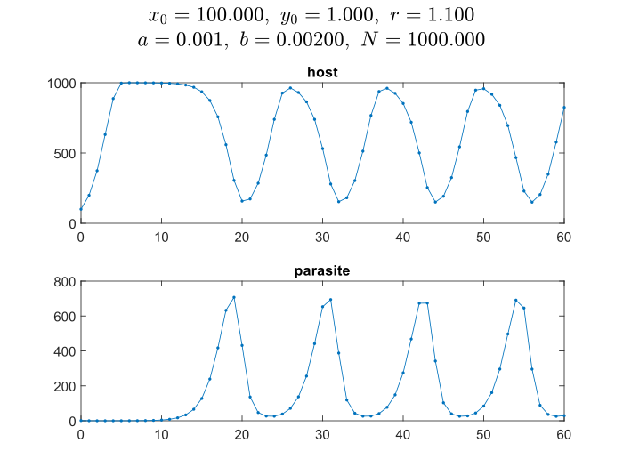
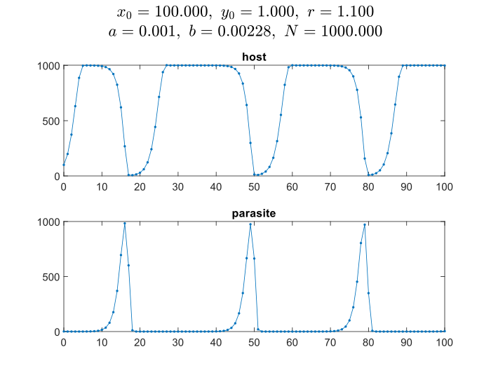
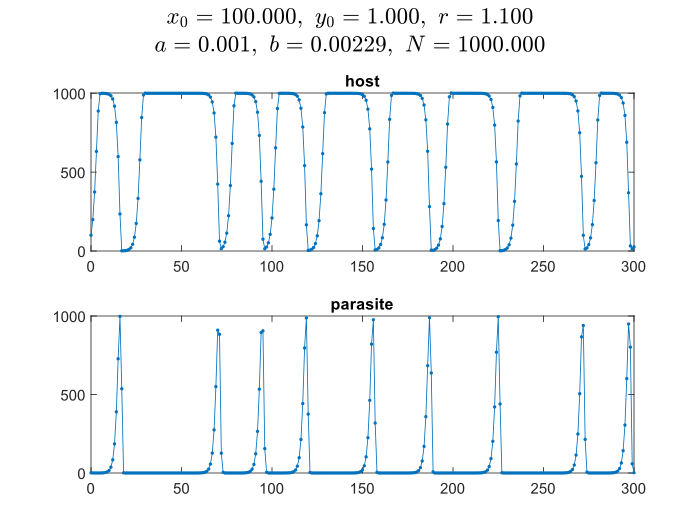
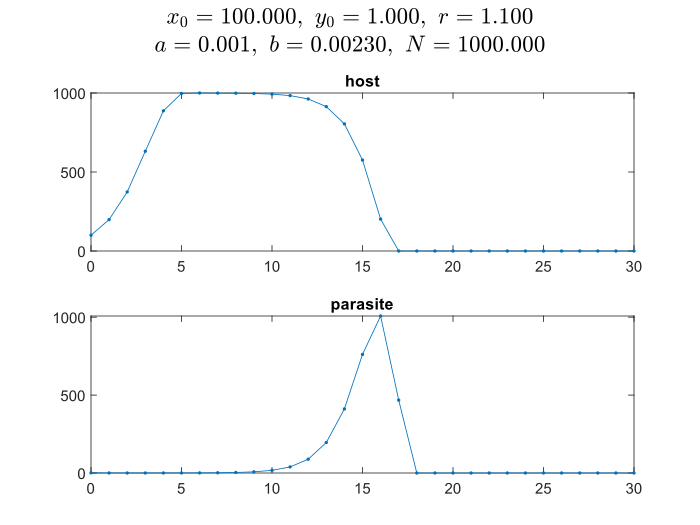

# 实验目的

1. 掌握用 MATLAB 软件求解非线性方程和方程组的基本用法，并对结果作初步分析。
2. 练习用非线性方程和方程组建立实际问题的模型并进行求解。

# Ex.6

## 题目

给定 4 种物质对应的参数 $a_i,b_i,c_i$ 和交互作用矩阵 $Q$ 如下：

$$ \begin{array}{llll}a_{1}=18.607, & a_{2}=15.841, & a_{3}=20.443, & a_{4}=19.293 ; \\ b_{1}=3643.31, & b_{2}=2755.64, & b_{3}=4628.96, & b_{4}=4117.07 ; \\ c_{1}=239.73, & c_{2}=219.16, & c_{3}=252.64, & c_{4}=227.44 ;\end{array} $$

在压强 $P=760 \mathrm{mmHg}$ 下，为了形成均相共沸混合物，温度和组分分别是多少？请尽量找出所有可能的解。

## 代码

```matlab
n = 3;
P = 760;
a = [18.607 15.841 20.443 19.293];
b = [3643.31 2755.64 4628.96 4117.07];
c = [239.73 219.16 252.64 227.44];
Q = [1.0 0.192 2.169 1.611
    0.316 1.0 0.477 0.524
    0.377 0.36 1.0 0.296
    0.524 0.282 2.065 1.0];
XT0 = [0.25 0.25 0.25 50];
[XT, Y] = fsolve(@model, XT0, [], P, a, b, c, Q)

function f = model(XT, P, a, b, c, Q)
    n = length(XT);
    x = XT;
    x(n) = 1 - sum(x(1:n-1));
    T = XT(n);

    f = zeros(1, n);
    for i = 1 : n
        f(i) = x(i) * ( b(i)/(T+c(i)) + log(x*Q(i, 1:n)') + ...
         sum(x .* Q(1:n, i)' ./ (Q*x')') - 1 - a(i) + log(P) );
    end
end
```

## 结果

用不同的初值和温度，得出的结果如下表所示：

| init                 | $x_1$  | $x_2$  | $x_3$  | $x_4$  | $T$     |
|----------------------|--------|--------|--------|--------|---------|
| [0.25 0.25 0.25 50]  | 0.6247 | 0.3753 | 0.0000 | 0.0000 | 58.1358 |
| [0.25 0.25 0.25 100] | 0.0000 | 0.0000 | 0.0000 | 1.0000 | 97.7712 |
| [0.25 0.25 0.25 200] | 0.0000 | 0.0000 | 1.0000 | 0.0000 | 82.5567 |
| [0.0 1.0 0.0 80]     | 0.0000 | 1.0000 | 0.0000 | 0.0000 | 80.1162 |
| [1.0 0.0 0.0 80]     | 1.0000 | 0.0000 | 0.0000 | 0.0000 | 64.5465 |


# Ex.9

## 题目

寄主-寄生现象是自然界中常有的，如黄蜂的幼虫寄生在象鼻虫（寄主）体内。一方面，寄主通常靠自然资源为生，不妨假定它的数量变化用离散形式的阻滞增长模型(45)描述，而寄生物的存在会减少其增长。显然，寄生物数量越多，寄主的增长率减少得越多，最简单的假设是，寄主的减少率与寄生物数量成正比。另一方面，寄生物完全靠寄主为生，可以自然地假定它的相邻两代数量之比与寄主数量成正比。建立一个寄主-寄生模型研究二者数量变化的规律，讨论时间充分长以后的趋势。

## 模型

以种群繁殖的周期划分时段，记时段 $k$ 寄主的种群数量为 $x_k$，固有增长率是 $r$，当增长受到资源制约时，设种群最大容量为 $N$，阻滞增长模式的离散形式可表示为
$$
x_{k+1} - x_k = r\left(1 - \frac{x_k}{N}\right) x_k,\ k = 0, 1, 2, \cdots
$$

设寄生物在时段 $k$ 的数量为 $y_k$，若假设寄主增长率的减少率与寄生物数量成正比，则寄主数量有
$$
x_{k+1} = max \left\{ 0,\  \left[
    r \left( 1 - \frac{x_k}{N} \right) + 1
    \right] (1 - a y_k) x_k \right\}
    ,\ k = 0, 1, 2, \cdots,\ a > 0
$$

对于寄生物的数量，假定其相邻两代数量之比与寄主数量成正比，则有
$$
y_{k+1} = b x_k y_k,\ k = 0, 1, 2, \cdots,\ b > 0
$$

## 代码

```matlab
x_0 = 100;
y_0 = 1;
r = 1.1;
N = 1000;
a = 0.001;
b = 0.002;

n = 60;

x = zeros(1, n+1);
y = zeros(1, n+1);
x(1) = x_0;
y(1) = y_0;

for i = 1 : n
    x(i+1) = max(0, (r * (1 - x(i) / N) + 1) * (1 - a * y(i)) * x(i));
    y(i+1) = b * x(i) * y(i);
end

subplot(1, 2, 1);
plot(0:n, x, '.-');
title('host')

subplot(1, 2, 2);
plot(0:n, y, '.-');
title('parasite')

sgtitle({
    sprintf('$x_0=%.3f,\\ y_0=%.3f,\\ r=%.3f$', x_0, y_0, r), ...
    sprintf('$a=%.3f,\\ b=%.3f,\\ N=%.3f$', a, b, N)
}, 'Interpreter', 'latex')

saveas(gcf, sprintf('ex9-x0_%.3f-y0_%.3f-r_%.3f-a_%.3f-b_%.3f-N_%.3f.svg', x_0, y_0, r, a, b, N))
```

## 结果

固定其他参数，只改变 $b$ 的取值，取 $b = 0.001, 0.0011, 0.0015, 0.002, 0.00228, 0.00229, 0.00230$，分别画出宿主和寄生物的数量变化。

<div style="display: grid; grid-template-columns: repeat(3, 1fr)">















</div>

可以看到：

- $b = 0.001$ 时，时间充分长后，宿主数量无限接近 $N$ 达到饱和，寄生物数量数量很少，但也保持稳定
- $b = 0.0011$ 时，由于寄生物数量少，宿主先提升至最大数量，最终保持稳态的数量会比最大数量低一点，同时寄生物数量也有所提升，最终达成稳态
- $b = 0.0015$ 时，宿主提升至最大数量后，宿主和寄生物均会出现波动，最终也会保持相对稳定
- $b = 0.002, 0.00228, 0.00229$ 时，宿主和寄生物最后会不断波动，基本上为寄生物数量少时宿主数量上升，使得寄生物数量增加，进而使得宿主减少，再导致寄生物减少，反复循环。区别只是周期不同，极值大小不同，极值持续时间长短不同
- $b = 0.023$ 时，宿主提升至最大数量后，寄生物数量过多使得宿主数量急剧下降直至灭绝，宿主灭绝后寄生物也随之灭绝。


> **宿主灭绝的临界值**
> 
> 宿主的递推公式中的系数 $(1 - a y_k)$ 是关键因素，宿主在时段 $k+1$ 灭绝当且仅当 $1 - ay_k \leq 0$ 即 $y_k \geq 1/a$. $b = 0.002, 0.00228, 0.00229$ 时寄生物数量均未超过 $1/a$，宿主数量便下降到让寄生物负增长的程度了；但 $b = 0.023$ 时寄生物增长太快，在宿主数量降到让寄生物负增长之前就超过了 $1/a$，从而使得宿主灭绝。

除参数 $b$ 之外，我也尝试了改变其他几种参数，发现得到的图像与上面的类似，$bx_k$ 和 $ay_k$ 分别作为寄生物的系数和宿主的系数，$b$和$x_0$ 、$a$和$y_0$ 共同起到决定性作用。


